# ĐỒ ÁN 2 - 20211 - HUST
##### Sinh viên thực hiện: Nguyễn Trần Thức
##### Giảng viên hướng dẫn: Thầy Ngô Trung Hiếu

### Công nghệ sử dụng
Flask, Tensorflow Serving, Keras, Heroku, AWS S3, Freenom, Google Colab

### Kiến trúc hệ thống

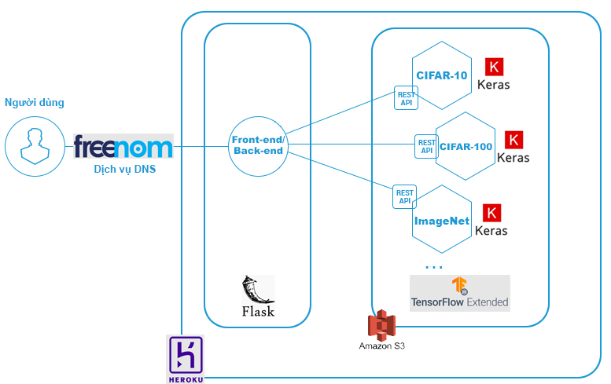

### Cài đặt trên local Window OS

Tạo thư mục dự án

```sh
mkdir my_project && cd my_project
```

Cài và setup môi trường ảo

```sh
pip install virtualenv
py -m venv env
cd env/Scripts
activate
cd..
cd..
```

Clone code và chạy trên local

```sh
git clone https://github.com/tranthuc99/project2.git
cd project2
pip install -r requirements.txt
py app.py
```

Nhập url: http://127.0.0.1:5000/ trên trình duyệt web!

### Báo cáo LaTeX
https://www.overleaf.com/read/nmdchvzvhxbr

### Slides Beamer
https://www.overleaf.com/read/fbzywkxtvkst

### Demo

api: https://apimodel-da2.herokuapp.com/v1/models/cnncifar10

web: http://www.ntt-project2.ml/ (hoặc https://flask4-da2.herokuapp.com/)

### Một số hình ảnh dự đoán

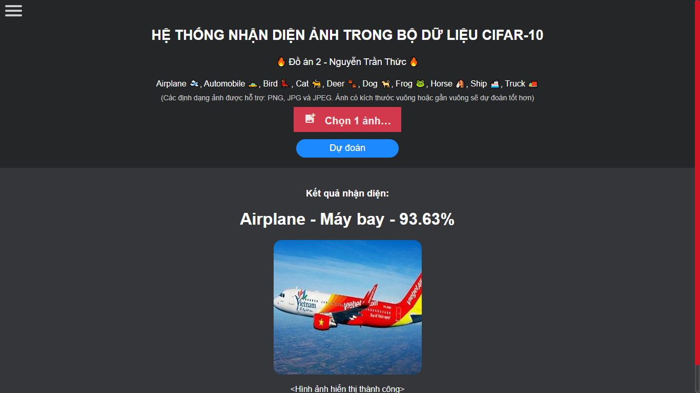
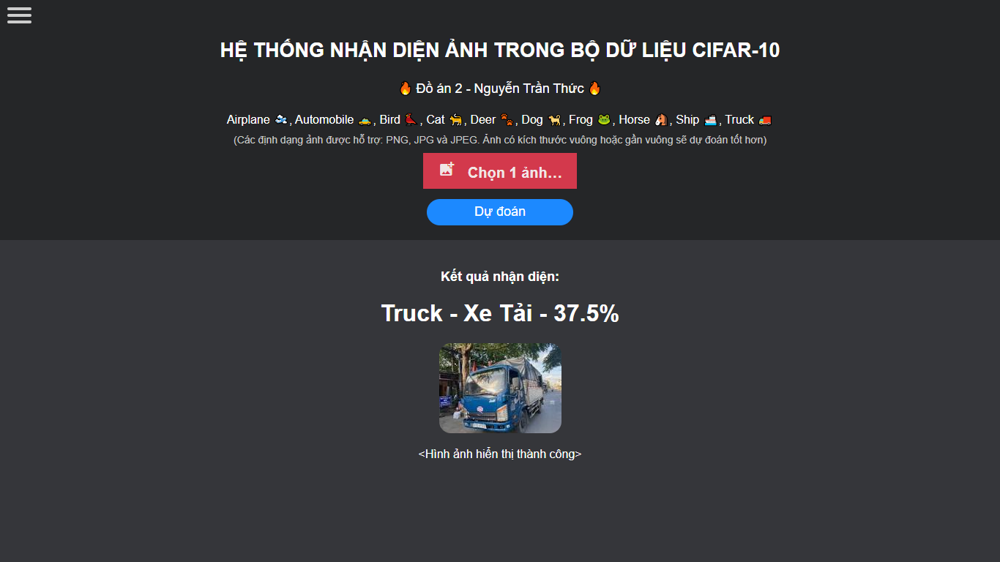
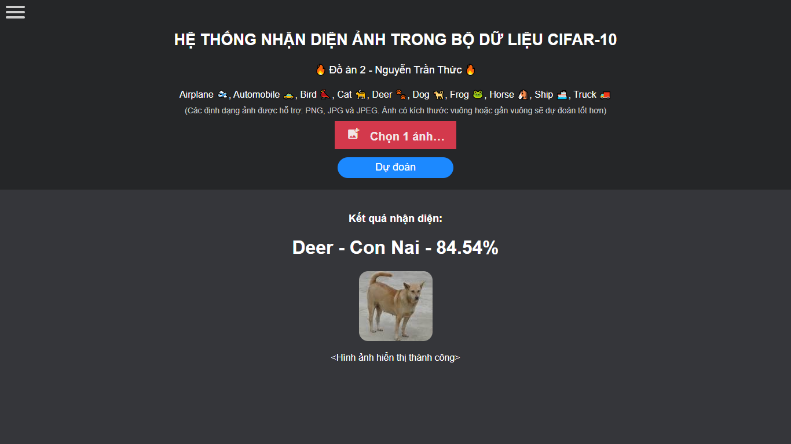
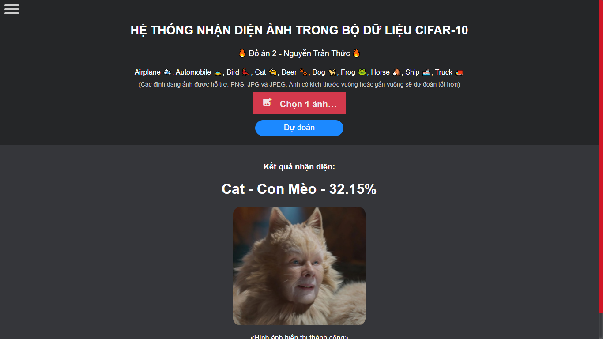
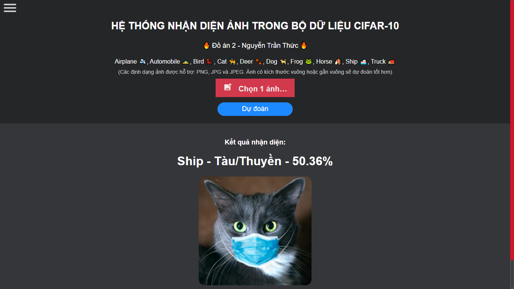
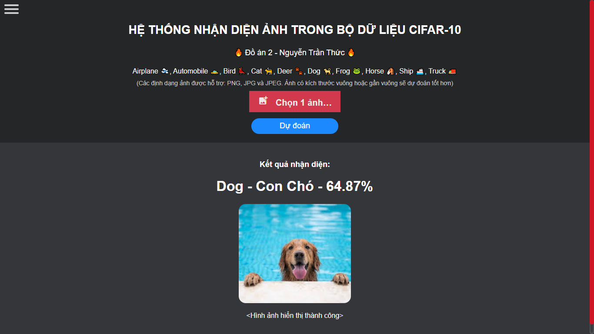
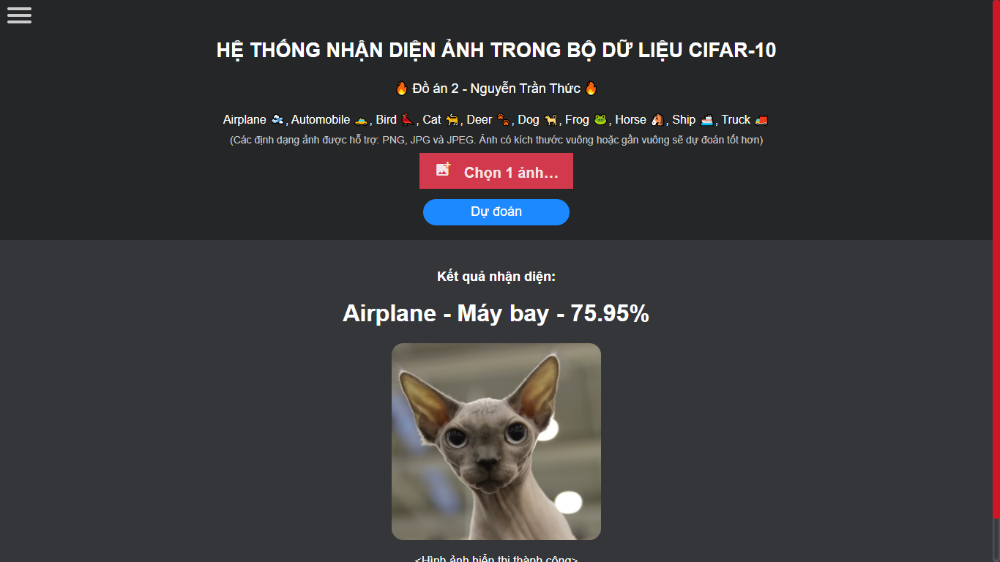
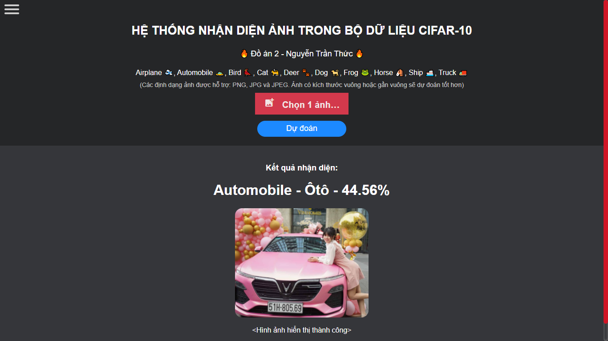
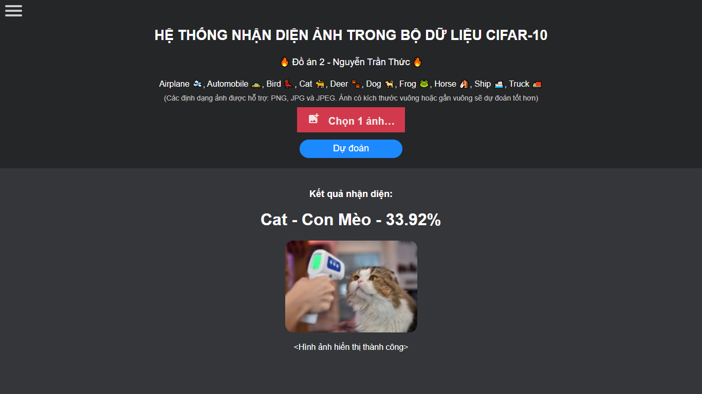

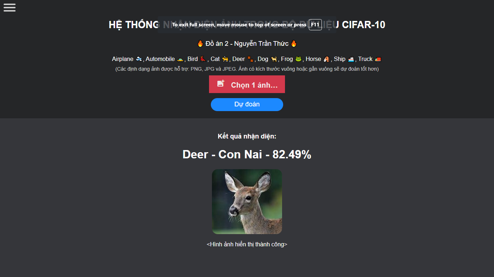
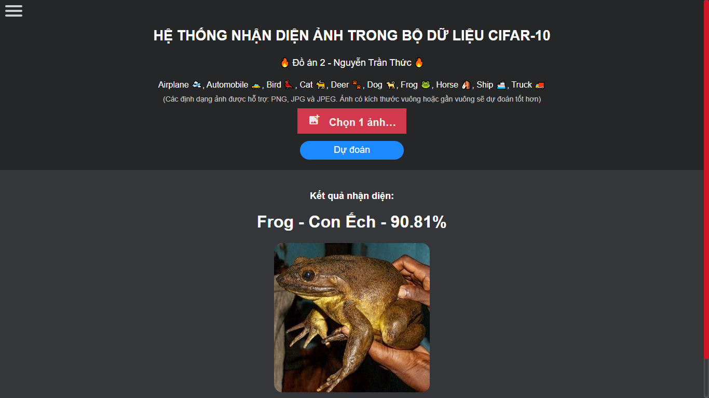
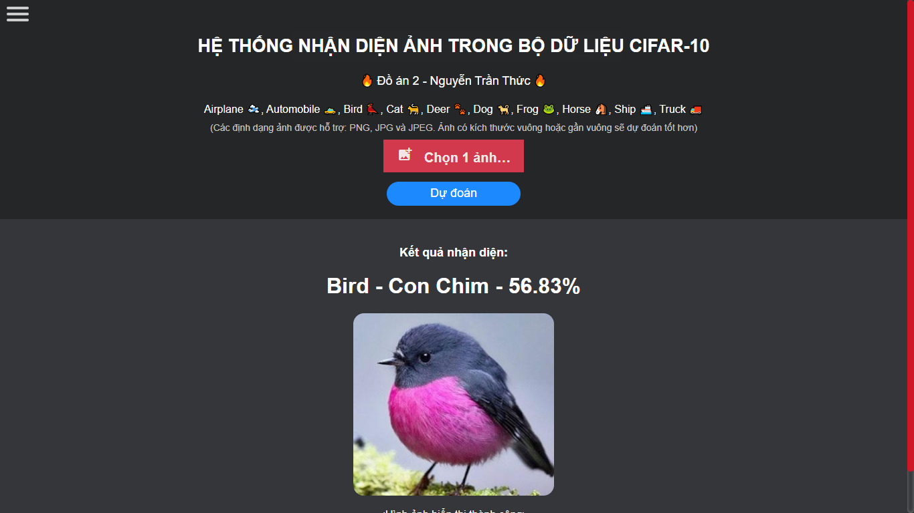
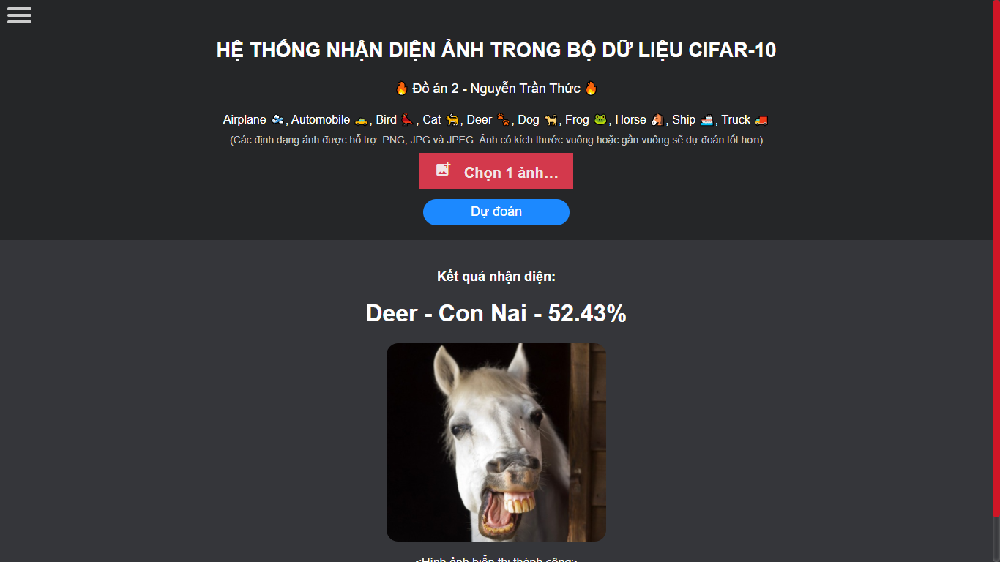
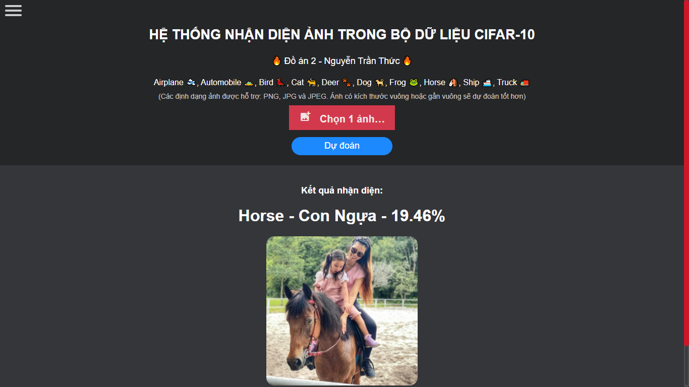
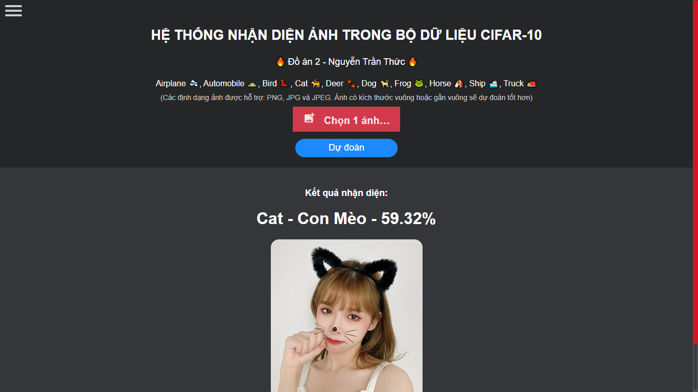
